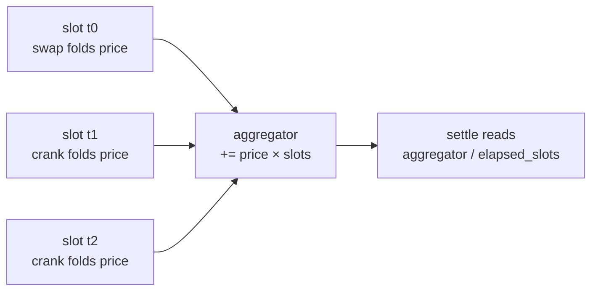

Each challenge market has **two** constant-product AMMs from MetaDAO's standalone
**v0.4.2** AMM: a **pass pool** trading pass-KASS against pass-USDC, and a **fail
pool** trading fail-KASS against fail-USDC. Kassandra stays on this AMM specifically
because it carries a built-in **slot-weighted delayed-TWAP** oracle — the exact price
signal the settle verdict reads. (The v0.6 Meteora stack used for governance has no
TWAP, which is why the challenge market does not use it.)

## Program id

```text
amm (v0.4.2, delayed-twap): AMMyu265tkBpRW21iGQxKGLaves3gKm2JcMUqfXNSpqD
```

Defined as `AMM_ID` in `programs/oracles/src/cpi/metadao.rs:56-59`, and as
`ammV04.AMM_V04_ID` / `EXTERNAL_PROGRAM_IDS.ammV04` in the SDK
(`sdk/src/amm-v04/constants.ts`).

## The two pools

| Pool | Base mint | Quote mint | What its price means |
| --- | --- | --- | --- |
| **Pass** | pass-KASS | pass-USDC | USDC value of a unit of the bond **if the claim survives** |
| **Fail** | fail-KASS | fail-USDC | USDC value of a unit of the bond **if the claim is disqualified** |

Each pool PDA is `[b"amm__", base_mint, quote_mint]` (note the **double** trailing
underscore) under the AMM program. The LP mint is `[b"amm_lp_mint", amm]`, and the
pool's token vaults are the ATAs of the `Amm` PDA
(`programs/oracles/src/cpi/metadao.rs:100-107, 231-292`; SDK `ammV04.pda.*`).

## Seeding a pool

Composition creates each pool with `create_amm`, then funds it with `add_liquidity`.
The seed math mirrors the E2E `build_pool` exactly
(`app/src/data/actions/challengeCompose.ts:60-81, 364-416`):

```text
twap_initial_observation             = quoteReserve * 1e12 / baseReserve
twap_max_observation_change_per_update = (2^64 − 1) * 1e12
twap_start_delay_slots               = 0
add_liquidity(quote_amount = quoteReserve, max_base_amount = baseReserve)
```

The defaults are 100 KASS (9 dp) base and 100 USDC (6 dp) quote, which seeds an initial
price of `1.0`. The huge `twap_max_observation_change_per_update` means a single crank
folds the new price with **no clamp** on how far it can move per update.

<Info>
  `twap_initial_observation` uses `PRICE_SCALE = 1e12` — every price the oracle stores
  is a `1e12`-scaled integer of **quote per base** (raw-USDC per raw-KASS, with the
  9 dp ↔ 6 dp decimal difference already folded into the raw ratio).
</Info>

### create_amm / add_liquidity args

```rust
// programs/oracles/src/cpi/metadao.rs:78-90 (Borsh)
create_amm    { twap_initial_observation: u128,
                twap_max_observation_change_per_update: u128,
                twap_start_delay_slots: u64 }         // 40 bytes
add_liquidity { quote_amount: u64, max_base_amount: u64, min_lp_tokens: u64 }
```

SDK builders: `ammV04.createAmm` (`sdk/src/amm-v04/instructions.ts:90`) and
`ammV04.addLiquidity` (`:145`). See the [SDK amm-v04 reference](/sdk/amm-v04).

## The `Amm` account and its embedded TWAP oracle

The `Amm` account is an Anchor `#[account]` (8-byte discriminator first, then Borsh
sequential little-endian fields) and embeds a `TwapOracle`
(`programs/oracles/src/cpi/metadao.rs:131-178`; app decoder
`app/src/data/ammV04.ts`):

```text
disc[8] | bump @8 | created_at_slot:u64 @9 | lp_mint @17 | base_mint @49
| quote_mint @81 | base_decimals @113 | quote_decimals @114 | base_amount:u64 @115
| quote_amount:u64 @123 | oracle.last_updated_slot:u64 @131 | last_price:u128 @139
| last_observation:u128 @155 | aggregator:u128 @171
| max_observation_change_per_update:u128 @187 | initial_observation:u128 @203
| start_delay_slots:u64 @219 (v0.4.1+ delayed-twap) | seq_num:u64 @227
```

The `Amm` account discriminator is `sha256("account:Amm")[..8]` =
`8f f5 c8 11 4a d6 c4 87` (`metadao.rs:161`), which settle checks as
defense-in-depth.

## How the TWAP accumulates

The oracle is **slot-weighted**: `aggregator` accumulates `price * 1e12` **per slot**
that passes. Two operations fold the current spot price into it:

- **Swaps** fold the post-trade price automatically.
- **`crank_that_twap`** folds the current price on demand, rate-limited to once per
  `ONE_MINUTE_IN_SLOTS = 150` slots (`metadao.rs:91-94`). See
  [Cranking the TWAP](/challenge/cranking).

## How the TWAP is read

Settle reads the **stored** aggregator — it does **not** crank. Kassandra's
`verify_and_read_twap` (`settle_challenge.rs:203-217`) and the app's `twapPrice`
(`app/src/data/ammV04.ts:162-167`) both compute:

```text
twap = aggregator / (last_updated_slot − (created_at_slot + start_delay_slots))
```

If the denominator is `0` or `aggregator == 0` — i.e. the pool was never traded, or is
still inside the start-delay window — the TWAP reads `0`, which the verdict interprets
as "no counter-trading, claim survives." The result is a `1e12`-scaled integer of quote
per base.

The window is bounded by `market.twap_end = open_time + oracle.twap_window`; settle
gates on `now ≥ market.twap_end`.

## Why this resists last-block manipulation



The manipulation resistance comes from **not** letting a last-moment observation
dominate the window average (`settle_challenge.rs:23-34`). Because the aggregator is a
**time-weighted sum over the whole window**, a single price spike in the final block
contributes only the slots it actually persisted — it cannot move a long window's
average. Settle consumes the *stored* average, and trading parties plus permissionless
crankers keep that average fresh throughout the window. To move the verdict you must
hold a price for a meaningful fraction of the window, not just the last slot.

<Warning>
  A single crank cannot move the TWAP meaningfully — the aggregator weights the
  pre-swap observation across the whole elapsed window. Moving the verdict requires
  **accumulating** the new price over multiple cranks spaced ≥150 slots apart (the E2E
  fraud path uses two cranks 300 slots apart). This is the whole point: the TWAP
  measures a sustained price, not an instant.
</Warning>

<Note>
  The v0.6 futarchy spot oracle used by `kass_price` is the analogous but
  **timestamp-weighted** version — `aggregator / (last_updated_ts − (created_at_ts +
  start_delay_seconds))` (`programs/oracles/src/cpi/metadao_v06.rs:385-415`). That
  one anchors the challenger's USDC escrow size, not the verdict.
</Note>

## Next

<CardGroup cols={2}>
  <Card title="Composing a market" icon="layer-group" href="/challenge/composing">
    Where `create_amm` + `add_liquidity` sit in the 7-step sequence.
  </Card>
  <Card title="Cranking the TWAP" icon="rotate" href="/challenge/cranking">
    The ≥150-slot rate limit and why cranking accumulates the aggregator.
  </Card>
</CardGroup>
