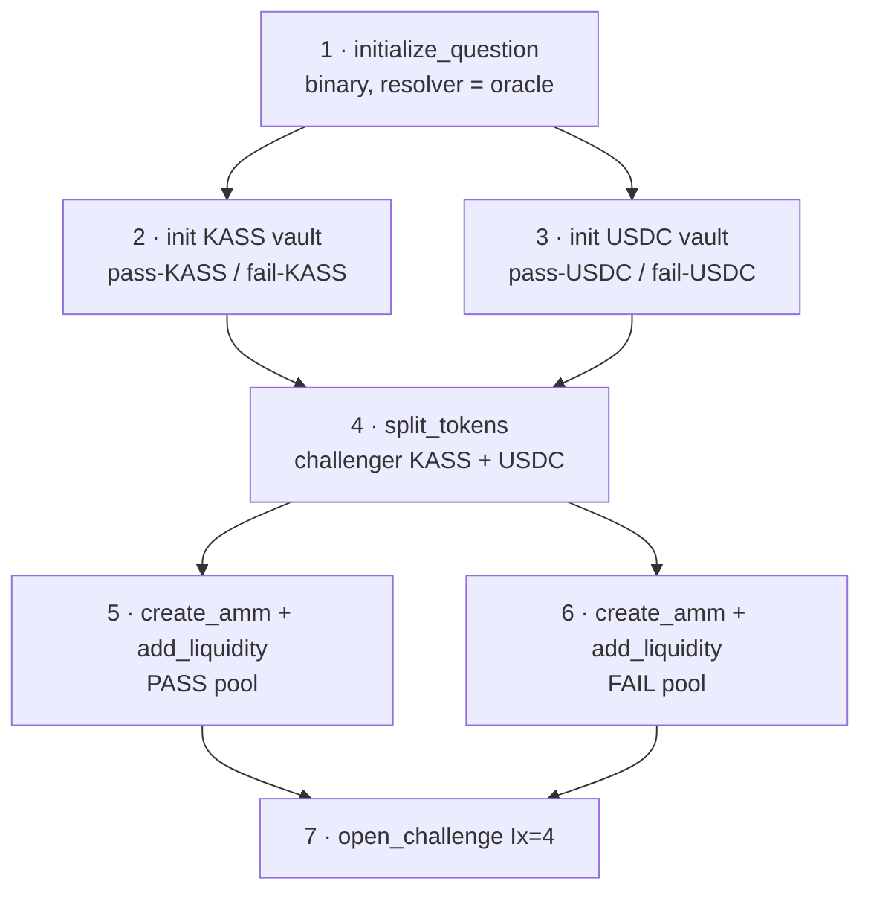

`open_challenge` does **not** create the MetaDAO accounts. The challenger **composes**
the market off-chain, in their own transactions, and `open_challenge` then verifies and
records those accounts, splits the bond, escrows USDC, and flips the claim to
challenged (`programs/oracles/src/processor/open_challenge.rs:15-18`). This page
covers the composition — the seven steps that build the market before the Kassandra
instruction ever runs.

## The app builder

The whole sequence is produced by one app builder:

```ts title="app/src/data/actions/challengeCompose.ts:213"
buildComposeAndOpenChallengeIxs(/* ... */): ComposeStep[]
```

It returns an ordered list of single-transaction `ComposeStep`s, executed by the
`useComposeSequence` hook (`app/src/hooks/useComposeSequence.ts:65`). The steps live at
`challengeCompose.ts:302-449`. Each step is its own transaction because the MetaDAO
account creation is too large to fit in one.

## The 7-step sequence

<Steps>
  <Step title="Create question — conditional_vault::initialize_question">
    A binary question (`numOutcomes = 2`) whose **resolver is the Kassandra oracle
    PDA**. Outcome index **0 = pass, 1 = fail**. SDK: `futarchy.initializeQuestion`
    (`sdk/src/futarchy/instructions.ts:129`).
  </Step>
  <Step title="Create KASS vault — conditional_vault::initialize_conditional_vault">
    A vault with underlying = `oracle.kassMint`. Mints the conditional-token mints:
    idx 0 = **pass-KASS**, idx 1 = **fail-KASS**. SDK:
    `futarchy.initializeConditionalVault` (`:158`).
  </Step>
  <Step title="Create USDC vault — conditional_vault::initialize_conditional_vault">
    The same, with underlying = `oracle.usdcMint` → idx 0 = **pass-USDC**, idx 1 =
    **fail-USDC**.
  </Step>
  <Step title="Fund + split — conditional_vault::split_tokens">
    The challenger creates the ATAs it needs (including the oracle-PDA-owned pass/fail
    -KASS holders the bond will later be minted to), then `split_tokens` splits its
    **own** KASS → equal pass-KASS + fail-KASS and its **own** USDC → equal pass-USDC +
    fail-USDC, to seed the pools. SDK: `futarchy.splitTokens` (`:222`).
  </Step>
  <Step title="Seed pass pool — amm::create_amm + amm::add_liquidity">
    `create_amm(base = pass-KASS, quote = pass-USDC)` then `add_liquidity`. SDK:
    `ammV04.createAmm` (`sdk/src/amm-v04/instructions.ts:90`) and `ammV04.addLiquidity`
    (`:145`).
  </Step>
  <Step title="Seed fail pool — amm::create_amm + amm::add_liquidity">
    `create_amm(base = fail-KASS, quote = fail-USDC)` then `add_liquidity`.
  </Step>
  <Step title="Open challenge — Kassandra open_challenge (Ix=4)">
    The Kassandra instruction that verifies and records everything above, splits the
    bond, and escrows the challenger's USDC. SDK: `buildOpenChallengeIxs`
    (`sdk/src/instructions/challenge.ts:133`).
  </Step>
</Steps>



## Seed / TWAP math

Steps 5 and 6 mirror the E2E `build_pool` exactly
(`challengeCompose.ts:60-81, 364-416`):

```text
twap_initial_observation             = quoteReserve * 1e12 / baseReserve   // twapInitialObservation() :78
twap_max_observation_change_per_update = (2^64 − 1) * 1e12                 // MAX_OBSERVATION_CHANGE
twap_start_delay_slots               = 0
add_liquidity(quote_amount = quoteReserve, max_base_amount = baseReserve)
```

Defaults (`challengeCompose.ts` consts `DEFAULT_BASE_RESERVE` / `DEFAULT_QUOTE_RESERVE`,
`PRICE_SCALE`, `MAX_OBSERVATION_CHANGE`, `DEFAULT_QUESTION_ID`): base 100 KASS (9 dp),
quote 100 USDC (6 dp) → a seeded price of `1.0`. See
[AMMs and the TWAP](/challenge/amms-and-twap) for what the observation fields mean.

## What open_challenge verifies (step 7)

`open_challenge` (`open_challenge.rs:153`) takes a payload of just `oracle_nonce: u64
LE` (8 bytes) and binds the externally-composed accounts:

- **Gates** — phase must be `Phase::Challenge` and before the oracle's end
  (`require_phase` / `require_before_end`, `:173-175`); the oracle PDA is re-derived
  from `oracle_nonce` (`:179-183`).
- **Claim + proposer** — the claim is not already challenged; the proposer is not
  disqualified.
- **Question** — resolver == oracle and `num_outcomes == 2` (`:210-223`).
- **Vaults** — KASS vault underlying == `oracle.kass_mint` (`:225-239`); USDC vault
  underlying == `oracle.usdc_mint` (`:241-250`).
- **AMMs** — only `owner == AMM_ID` is checked here; the **hard** mint-pair binding is
  deferred to settle (`:252-259`).
- **Conditional mints** — pass/fail-KASS mints == `conditional_token_mint_pda(kass_vault,
  0 / 1)` (`:261-265`).

It then program-splits the bond, escrows the challenger's USDC (sized via `kass_price`),
creates the `Market` PDA at `[b"market", ai_claim]`, sets `ai_claim.challenged = 1`, and
increments `oracle.open_challenge_count`. Those on-chain effects are detailed under
[Settlement](/challenge/settle) and [Economics](/challenge/economics).

<Warning>
  Composition happens in the challenger's own transactions with the challenger's own
  capital. Only step 7 touches Kassandra state. If any binding check in step 7 fails,
  the whole `open_challenge` reverts — but the composed MetaDAO accounts from steps 1-6
  already exist on-chain (they are the challenger's to reuse or abandon).
</Warning>

## SDK pieces

| Step | SDK builder | Source |
| --- | --- | --- |
| 1 | `futarchy.initializeQuestion` | `sdk/src/futarchy/instructions.ts:129` |
| 2, 3 | `futarchy.initializeConditionalVault` | `:158` |
| 4 | `futarchy.splitTokens` | `:222` |
| 5, 6 | `ammV04.createAmm` / `ammV04.addLiquidity` | `sdk/src/amm-v04/instructions.ts:90, 145` |
| 7 | `buildOpenChallengeIxs` | `sdk/src/instructions/challenge.ts:133` |

The React entry point is `ChallengeControl` (`app/src/components/oracles/actions/
ChallengeControl.tsx:18`), which drives compose + open via `useComposeSequence` and
`buildComposeAndOpenChallengeIxs`.

## Next

<CardGroup cols={2}>
  <Card title="Trading" icon="arrow-right-arrow-left" href="/challenge/trading">
    Once the market is open, how traders bet pass vs fail.
  </Card>
  <Card title="Economics" icon="coins" href="/challenge/economics">
    The bond split, the USDC escrow sizing, and the fees.
  </Card>
</CardGroup>
