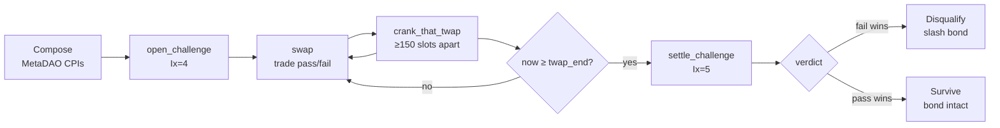

A **challenge market** is a MetaDAO v0.4 decision (futarchy) market that Kassandra
uses to arbitrate a disputed AI claim. When a proposer's AI claim looks fraudulent, a
challenger opens a binary conditional market on the proposer's **KASS bond**
(pass-KASS vs fail-KASS, each priced in conditional USDC); traders move a
time-weighted average price (TWAP); after a window closes, settlement reads the TWAP
and either **disqualifies** the proposer (fraud) or lets the claim **survive**
(honest). The market — not the AI, and not a committee — is the ultimate arbiter of
truth.

Kassandra is a **Pinocchio** program (no Anchor). It drives the Anchor MetaDAO
programs by hand-reconstructing their wire format: an 8-byte sighash discriminator,
ordered account metas, and Borsh args. All of the CPI wire code for the challenge
stack lives in `programs/oracles/src/cpi/metadao.rs` (the v0.4 standalone
conditional vault + AMM). The separate v0.6 futarchy + Meteora stack in
`programs/oracles/src/cpi/metadao_v06.rs` is the governance / `kass_price` layer,
**not** the challenge market.

## Why challenge markets exist

The whole dispute machinery only fires when proposers disagree. An **uncontested**
claim is honest by assumption: it has **no `Market` account and costs nothing**
(`programs/oracles/src/processor/open_challenge.rs:15-18`). The challenge market is
**dormant by default** — it materializes only when someone puts real money behind the
assertion "this AI claim is fraudulent."

Because interpretation is fixed at oracle creation, a dispute reduces to *did the AI
apply the fixed rules to the agreed facts correctly?* — an objective question a market
can price. The market lets capital, not authority, override a faulty AI claim.

## The actors and their stakes

<CardGroup cols={2}>
  <Card title="Proposer" icon="user-shield">
    Made the AI claim. Their locked KASS **bond** is the conditional collateral: it is
    split into idle pass-KASS + fail-KASS and is slashed if the market disqualifies
    them.
  </Card>
  <Card title="Challenger" icon="gavel">
    Opens the market and **escrows USDC** sized to the bond's value via `kass_price`.
    Seeds the pools and typically trades the fail side. Earns a KASS fee if the
    challenge succeeds.
  </Card>
  <Card title="Traders" icon="arrow-right-arrow-left">
    Anyone can buy/sell pass or fail. Fraud-believers push fail up and pass down;
    honesty-believers do the opposite. Their trades move the TWAP the verdict reads.
  </Card>
  <Card title="Crankers" icon="rotate">
    Anyone (permissionless) can call `crank_that_twap` to fold the current price into
    the slot-weighted aggregator, keeping the TWAP fresh across the window.
  </Card>
</CardGroup>

The design is a **conditional-stake market**: pass-KASS and fail-KASS are fungible
across participants, so the TWAP prices *a unit of the proposer's stake conditional on
the claim surviving (pass) vs being disqualified (fail)*, regardless of whose tokens
trade. The bond's own conditional tokens stay **idle — never LP'd** — so the bond
takes no impermanent loss; the market liquidity is the challenger's (and traders').

## Single parallel round, incremental settlement

Every AI claim on an oracle is challengeable **in parallel**, in a single round. Each
challenge is an independent `Market` PDA at `[b"market", ai_claim]`. Settlement is
**incremental**: `settle_challenge` settles **one** market per call — the phase stays
`Challenge` until every open market is resolved, after which the final plurality over
surviving proposers is recomputed (a later `finalize_oracle` step). The oracle tracks
outstanding markets with `oracle.open_challenge_count`, which `open_challenge`
increments and `settle_challenge` decrements.

<Note>
  This bounds termination: the number of markets is bounded by the number of AI claims,
  each market has a fixed `market.twap_end` window, and each settles exactly once
  (`market.settled = 1`). There is no unbounded re-challenge loop.
</Note>

## The lifecycle at a glance

<Steps>
  <Step title="Compose (challenger, off-chain)">
    The challenger builds the MetaDAO market in their own transactions: a binary
    question, the KASS and USDC conditional vaults, a `split`, and the two seeded
    pass/fail AMMs. See [Composing a market](/challenge/composing).
  </Step>
  <Step title="Open (open_challenge, Ix=4)">
    Kassandra verifies and records those accounts, program-splits the proposer's bond
    into idle pass/fail-KASS, escrows the challenger's USDC, and flips the claim to
    challenged. It does **not** create the MetaDAO accounts.
  </Step>
  <Step title="Trade (swap)">
    Traders buy/sell pass and fail. To disqualify, they buy the fail pool (raising the
    fail-KASS price). See [Trading](/challenge/trading).
  </Step>
  <Step title="Crank (crank_that_twap)">
    Permissionless cranks fold the price into the slot-weighted TWAP, rate-limited to
    once per 150 slots. See [Cranking the TWAP](/challenge/cranking).
  </Step>
  <Step title="Settle (settle_challenge, Ix=5)">
    Once `now ≥ market.twap_end`, anyone settles: the verdict formula reads the TWAP,
    the question resolves, the bond redeems, and directional fees route. See
    [Settlement](/challenge/settle).
  </Step>
</Steps>

## Explore the deep-dive

<CardGroup cols={2}>
  <Card title="Conditional vaults" icon="vault" href="/challenge/conditional-vaults">
    Splitting KASS and USDC into pass/fail conditional tokens, and redeeming on
    resolution.
  </Card>
  <Card title="AMMs and the TWAP" icon="chart-line" href="/challenge/amms-and-twap">
    The pass/fail pools, seeding, and the slot-weighted delayed-TWAP that resists
    last-block manipulation.
  </Card>
  <Card title="Composing a market" icon="layer-group" href="/challenge/composing">
    The 7-step MetaDAO CPI sequence and the app builder that stitches it together.
  </Card>
  <Card title="Trading" icon="arrow-right-arrow-left" href="/challenge/trading">
    `swap` semantics — betting pass vs fail — and the SDK/app builders.
  </Card>
  <Card title="Cranking" icon="rotate" href="/challenge/cranking">
    Why the TWAP must be cranked, the ≥150-slot rate limit, and who cranks.
  </Card>
  <Card title="Settle" icon="scale-balanced" href="/challenge/settle">
    The exact verdict formula, resolution, redemption, and directional fees.
  </Card>
  <Card title="Economics" icon="coins" href="/challenge/economics">
    The bond, the USDC escrow, the slash, the fees, and the game theory.
  </Card>
  <Card title="Concept: challenge markets" icon="diagram-project" href="/concepts/challenge-markets">
    The higher-level "market as final arbiter" concept.
  </Card>
</CardGroup>
