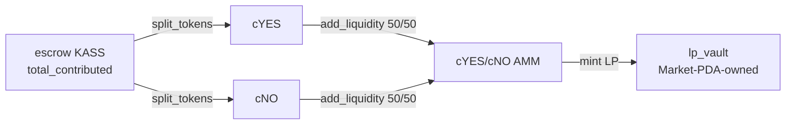

`activate` (`processor/activate.rs`) turns a fully-funded `Funding` market into a
live MetaDAO cYES/cNO AMM. It is a **permissionless crank**, and — mirroring the
Kassandra oracle's `open_challenge` precedent — it does **not create** the MetaDAO
accounts. The client composes the MetaDAO `Question`, KASS `conditional_vault`, and
cYES/cNO `Amm` in its own prior transactions; `activate` **verifies** they are
bound to this market, performs the program-signed value moves, and **records** the
bindings.

## Gates

Before touching anything, `activate` checks (`activate.rs:80-98`):

- `status == Funding` (else `NotFunding`);
- `total_contributed >= min_liquidity` (else `NotFunded`);
- the oracle is **non-terminal** — a resolved oracle must take the
  [cancel/refund exit](/market/crowdfunding), not activate (else `OracleResolved`).

## Verifying the composed MetaDAO market

Every composed account is re-derived, owner-checked, and its field bindings are
read and compared (`activate.rs:100-183`):

<Steps>
  <Step title="Question">
    Re-derived as `question_pda(oracle, market_pda, 2)`, owned by the
    conditional_vault program, with its stored `oracle` field **== the Market PDA**
    and `num_outcomes == 2`. The Market PDA being the question's oracle-authority is
    what makes the program the trustless resolver.
  </Step>
  <Step title="KASS conditional vault">
    Re-derived from the question + KASS mint; its `question`, `underlying_mint`
    (== `market.kass_mint`), and `underlying_account` must all match.
  </Step>
  <Step title="cYES / cNO mints + AMM">
    The conditional-token mints derive from the vault (idx 0 = cYES, idx 1 = cNO);
    the AMM re-derives from the (cYES, cNO) pair, carries the right discriminator,
    binds base = cYES / quote = cNO, and **must be empty** — a non-empty pool fails
    `PoolNotEmpty` so the clean 50/50 opening ratio is guaranteed.
  </Step>
  <Step title="LP mint + AMM vault ATAs + event authorities">
    The LP mint derives from the AMM; the AMM's per-mint vault ATAs and both
    MetaDAO event-authority PDAs are re-derived and asserted.
  </Step>
</Steps>

## The value moves (program-signed)

All CPIs use the **Market PDA as authority**, signed with the market seeds
`[b"market", market.oracle, [market.outcome_index], [market.bump]]` — the same
seeds `refund` uses.

1. **Create three Market-PDA-owned token accounts** — transient cYES/cNO holders
   `[b"cyes", market]` / `[b"cno", market]` and an LP holder `[b"lp_vault", market]`.
   Each uses a create-or-adopt (Allocate + Assign + InitializeAccount3) that
   tolerates a pre-funded address, so nobody can brick activation by donating a
   lamport to a derivable PDA (`activate.rs:328-393`).
2. **`split_tokens`** — the full escrow balance (`total_contributed`) splits into an
   equal amount of cYES and cNO (`activate.rs:219-254`).
3. **`add_liquidity`** — both legs are deposited in full into the empty pool
   (`base_amount == quote_amount == total_contributed`, `min_lp_tokens = 0`), a
   balanced 50/50 seed so no capital is stranded, and LP tokens are minted into
   `lp_vault` (`activate.rs:256-291`).

## Recording the bindings

`activate` measures the LP tokens now in `lp_vault` and records everything on the
`Market` (`activate.rs:293-310`): `question`, `vault`, `yes_mint`, `no_mint`,
`amm`, `lp_mint`, `lp_vault`, `lp_total` (the basis for pro-rata
[`claim_lp`](/market/resolution)), and flips `status = Active`. From here, trading
happens directly in the AMM — the market program is off the hot path.

<Note>
The cYES/cNO PDAs are **transient**: `add_liquidity` consumes the split, leaving
them empty; they are reused by [`collect_fee`](/market/resolution) as the
remove-liquidity/redeem destinations and closed by `close_market`. The `lp_vault`
holds the seeded LP until contributors claim it.
</Note>

See the [PDAs reference](/market-protocol/pdas) for every seed, and
[Resolution](/market/resolution) for what happens after the oracle settles.
