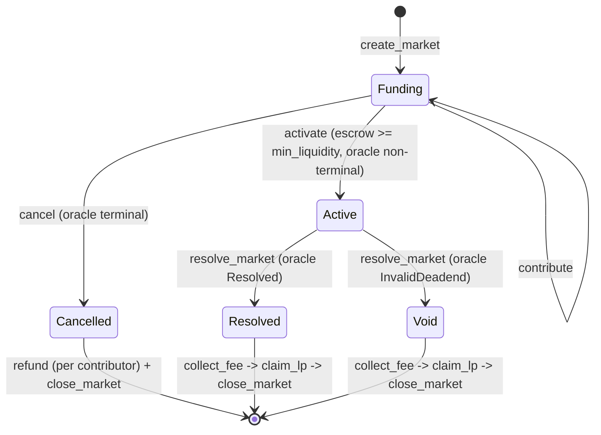

A market is a state machine over `MarketStatus` (`programs/markets/src/state.rs:33`),
stored as a single `u8` on the `Market` account. Every transition after
`create_market` is a **permissionless crank**: no privileged operator, no admin
key — anyone can pay the fee and push the market forward, and the program pins
each crank's outputs to immutable recorded fields so a cranker can never redirect
value.

## The five statuses

| Value | Status | Meaning |
| --- | --- | --- |
| 0 | `Funding` | Crowdfunding toward `min_liquidity`; not yet a live pool. |
| 1 | `Active` | Activated into a live cYES/cNO AMM; trading + resolution possible. |
| 2 | `Resolved` | Oracle resolved to a definite option; YES or NO leg pays. |
| 3 | `Void` | Oracle hit `InvalidDeadend`; every leg redeems for half. |
| 4 | `Cancelled` | Oracle went terminal before activation; contributors refund. |

## The state diagram

## The happy path

<Steps>
  <Step title="Funding">
    `create_market` stands up the `Market`, its KASS escrow, and the creator's
    `Contribution` (`processor/create_market.rs`). `contribute` tops the escrow up
    toward `min_liquidity` (`processor/contribute.rs`). See [Crowdfunding](/market/crowdfunding).
  </Step>
  <Step title="Active">
    Once `total_contributed >= min_liquidity` and the oracle is still non-terminal,
    `activate` composes the MetaDAO market, splits the escrow into cYES/cNO, seeds
    the AMM 50/50, and flips `status = Active` (`processor/activate.rs:81-98`).
    See [Activation](/market/activation).
  </Step>
  <Step title="Resolved / Void">
    When the Kassandra oracle is terminal, `resolve_market` bridges the result into
    the MetaDAO `resolve_question` and sets `status = Resolved` (a definite winner)
    or `status = Void` (`InvalidDeadend`) (`processor/resolve_market.rs:94-109`).
  </Step>
  <Step title="Drain + close">
    `collect_fee` cuts the protocol fee, `claim_lp` distributes LP pro-rata, and
    `close_market` reaps the account once every contribution has exited. See
    [Resolution](/market/resolution).
  </Step>
</Steps>

## The cancel / refund escape

A terminal oracle makes activation impossible, so a market still in `Funding`
whose oracle already resolved would strand its contributions. `cancel` is the
escape: it is permissionless, requires no signer beyond the fee payer, and flips a
`Funding` market to `Cancelled` **at any funding level** — including a fully-funded
market whose oracle resolved before anyone activated it
(`processor/cancel.rs:38-52`). The `status == Funding` guard still forbids
cancelling an already-`Active` market.

Once `Cancelled`, each contributor pulls their KASS back with `refund`
(`processor/refund.rs`), which reaps their `Contribution` — its absence is the
idempotency guard. There is no forfeiture; unreclaimable account rent is the only
spam cost.

<Note>
Terminal, in the oracle's terms, means `Phase::Resolved` (7) or
`Phase::InvalidDeadend` (8). The market reads only those four bytes from the oracle
account (`programs/markets/src/kass_oracle.rs`).
</Note>

## Why permissionless cranks

Deferring the heavy MetaDAO accounts to `activate` means a never-funded market
touches MetaDAO not at all — a clean refund, nothing to unwind. And because
`activate`, `resolve_market`, `collect_fee`, `claim_lp`, and `close_market` are all
permissionless, the market cannot get stuck waiting on a specific party: anyone who
wants the market to progress can crank it, and each crank binds its outputs to
recorded state so opening it up costs no safety. See the
[security model](/market-protocol/overview).
