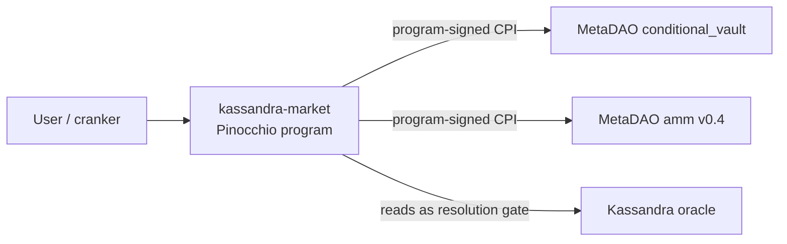
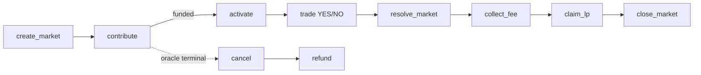

**Kassandra Market** is a KASS-denominated AMM prediction market on Solana. Anyone
can pre-create a market for a Kassandra oracle question below the liquidity floor;
others **crowdfund** it to a minimum; once funded it **activates** into a live
cYES/cNO AMM built on MetaDAO's v0.4 `conditional_vault` + `amm` primitives. When
the oracle resolves, the market settles, a protocol fee is cut to the KASS
futarchy, and liquidity providers claim their pro-rata share. Every phase after
creation is a **permissionless crank** — there is no privileged operator.

The program is written in **Pinocchio** (no Anchor), lives at
`programs/kassandra-market/`, and is deployed under program ID
`FEGNHWAB7kc7VC9CCwbvVPsv4Jykz2r2WQ758V4xCT9S` (`programs/kassandra-market/src/lib.rs:17`).
It is a sibling to — and depends on the resolution of — the
[Kassandra optimistic oracle](/guide/what-is-kassandra).

## The wrapper architecture

The market program is a thin, security-focused **wrapper**. It composes and
verifies MetaDAO accounts and program-signs the value-moving CPIs, but delegates
the actual vault/AMM mechanics to those audited programs, and defers resolution
entirely to the Kassandra oracle. It sits in the path only at **create /
activate / resolve / collect_fee / claim / close** — never on the trading hot
path, so per-trade there is no custody and no market-program CPI.

Because MetaDAO's `conditional_vault` resolves a market through a permissioned
`resolve_question` call from the question's designated **oracle authority**, a
trusted off-chain keeper holding that key would defeat Kassandra's entire premise.
So each market's MetaDAO `Question` names the **Market PDA** as its oracle
authority, and the program permissionlessly bridges the Kassandra `Oracle` result
into `resolve_question`. Settlement is trustless end to end; anyone can crank it.

## Binary sub-markets

Each market is a **binary sub-market** — "will the oracle resolve to
`outcome_index`? YES/NO". A categorical (N-option) oracle is therefore modeled as
**N independent binary sub-markets**, one per outcome; a plain binary market is the
special case `outcome_index = 0`. The pool is a single cYES/cNO AMM, so the spot
ratio *is* the implied probability: `price = cYES / (cYES + cNO)`.

## The lifecycle at a glance

<Steps>
  <Step title="Create + crowdfund (Funding)">
    A creator seeds any amount of KASS, even below the floor; anyone contributes
    toward `min_liquidity`. See [Crowdfunding](/market/crowdfunding).
  </Step>
  <Step title="Activate">
    A permissionless crank composes + records the MetaDAO Question/vault/AMM and
    seeds the pool 50/50. See [Activation](/market/activation).
  </Step>
  <Step title="Trade, then resolve">
    Trading happens directly in the AMM. Once the oracle is terminal,
    `resolve_market` bridges the result. See [Resolution](/market/resolution).
  </Step>
  <Step title="Collect fee, claim LP, close">
    The protocol fee is cranked to the futarchy, LPs claim pro-rata, and the
    drained market is reaped. See [Resolution](/market/resolution).
  </Step>
</Steps>

## Explore

<CardGroup cols={2}>
  <Card title="Lifecycle" icon="diagram-project" href="/market/lifecycle">
    The full status machine and the permissionless-crank model.
  </Card>
  <Card title="Crowdfunding" icon="hand-holding-dollar" href="/market/crowdfunding">
    create, contribute, cancel, refund and the Contribution accounts.
  </Card>
  <Card title="Activation" icon="layer-group" href="/market/activation">
    Composing + recording the MetaDAO bindings and seeding the AMM.
  </Card>
  <Card title="Resolution" icon="scale-balanced" href="/market/resolution">
    The resolve bridge, fee collection, LP claims, and close.
  </Card>
  <Card title="Reference · Program" icon="cube" href="/market-protocol/overview">
    Program ID, security model, instructions, accounts, PDAs, errors.
  </Card>
  <Card title="SDK" icon="scroll" href="/sdk/market">
    The `@kassandra-market/sdk` TypeScript client.
  </Card>
</CardGroup>
