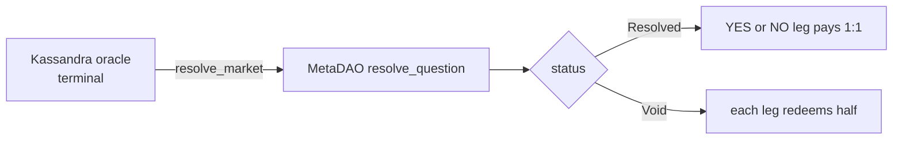

Once the Kassandra oracle is terminal, an `Active` market settles through four
permissionless cranks in a forced order: **resolve → collect_fee → claim_lp →
close**. Each binds its outputs to recorded state, so opening them to anyone costs
no safety.

## resolve_market (Ix 8)

`resolve_market` (`processor/resolve_market.rs`) bridges the terminal Kassandra
result into the market's MetaDAO `resolve_question`, so holders can redeem their
winning conditional tokens. The **Market PDA is the question's oracle-authority**,
so it is the resolver and signs the CPI — the writable `market` account doubles as
the CPI's `readonly_signer` via the market seeds.

The binary sub-market pays YES iff the oracle resolved to **this** market's
`outcome_index` (`resolve_market.rs:94-109`):

| Oracle phase | Numerators | Market status | Payout |
| --- | --- | --- | --- |
| `Resolved` (7), `resolved_option == outcome_index` | `[1, 0]` | `Resolved` | YES pays |
| `Resolved` (7), `resolved_option != outcome_index` | `[0, 1]` | `Resolved` | NO pays |
| `InvalidDeadend` (8) | `[1, 1]` | `Void` | each leg redeems for half |

The crank is idempotent — a second call sees `settled == 1` and returns
`AlreadySettled`. It also **short-circuits the fee crank**: if `fee_bps == 0` or
`lp_total == 0` there is nothing to collect, so it stamps `fee_collected = 1`
immediately (`resolve_market.rs:136-140`); otherwise `fee_collected` stays 0 and
`collect_fee` must run before LP claims open.

## collect_fee (Ix 9)

`collect_fee` (`processor/collect_fee.rs`) cuts the protocol's `fee_bps` share of
the market's **accrued** LP earnings and routes it, denominated in KASS, to the
futarchy-governed `Config.fee_destination`. It is a separate crank so `resolve`
stays lean and the heavy CPIs are isolated.

The accrued math is u128, floored, and conservative — it reads only the resolved
`Question` numerators, the AMM reserves, and the LP-mint supply (no full-pool
unwind) (`collect_fee.rs:174-242`):

1. `pool_value = (base·num0 + quote·num1) / denom` — the full pool's KASS value.
2. `realized_full = lp_total · pool_value / supply` — this market's LP value.
3. `accrued = realized_full − total_contributed` (saturating; 0 on impermanent
   loss / no profit → just set the flag and return).
4. `fee_lp = (lp_total · accrued / realized_full) · fee_bps / 10000`.

It then program-signs `remove_liquidity(fee_lp)` → `redeem_tokens` → SPL `transfer`
to send exactly the fee slice to `fee_destination`, sets `lp_total -= fee_lp`, and
stamps `fee_collected = 1`. Idempotent (a second call sees the flag).

## claim_lp (Ix 7)

`claim_lp` (`processor/claim_lp.rs`) is a permissionless per-contributor pull of
the seeded LP tokens, pro-rata to stake:
`floor(lp_total × contribution.amount / total_contributed)`. The **last claimer**
(`open_contributions == 1`) sweeps the entire remaining `lp_vault` balance so it
ends at exactly 0, absorbing floor-division dust.

<Warning>
The **fee gate is security-critical**: `claim_lp` requires `fee_collected == 1`
(`claim_lp.rs:97`). Because `fee_collected` is only set at/after resolution, an
`Active` market can never satisfy it — an early claim would move LP out before the
fee is cut. As with `refund`, the destination is verified to be the recorded
contributor's account **and** on `market.lp_mint`. The `Contribution` is closed on
claim (rent → contributor); its absence is the idempotency.
</Warning>

## close_market (Ix 10)

`close_market` (`processor/close_market.rs`) is the permissionless rent reclaim for
a fully-settled market. It requires `status ∈ {Resolved, Void, Cancelled}`,
`fee_collected == 1` for activated markets, and — the safety gate —
`open_contributions == 0`, so no contributor's unclaimed LP or refund is stranded.
It SPL-`CloseAccount`s the market's own token accounts (escrow always; cyes/cno/
lp_vault iff activated) only if empty, then closes the `Market` PDA, returning all
rent to the creator. A dust donation into a derivable Market-PDA token account
can't brick the close — a still-funded account is skipped rather than reverting.

See the [reference instructions](/market-protocol/instructions) for the exact
account lists, or [Activation](/market/activation) for the bindings these cranks
consume.
