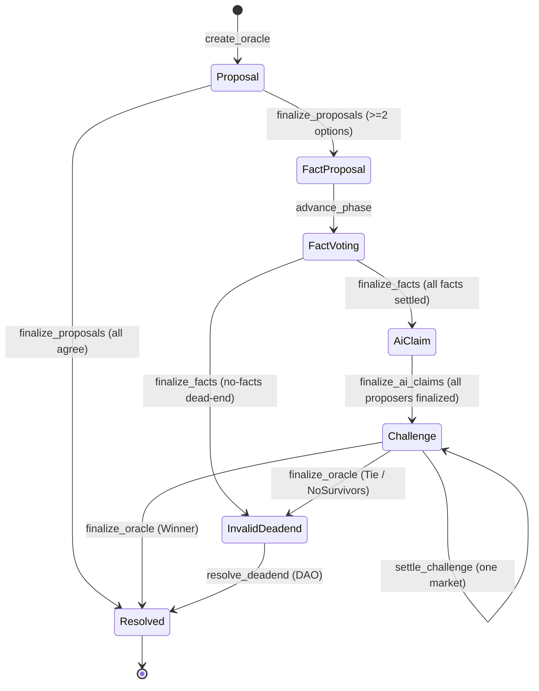

An oracle's lifecycle is a state machine encoded in `Oracle.phase` as a `u8` discriminant. The `Phase`
enum and its `from_u8` / `as_u8` helpers live in `programs/oracles/src/state.rs`. For the
conceptual walkthrough, see [Lifecycle](/concepts/lifecycle).

## The Phase enum

| # | Variant | Meaning |
| --- | --- | --- |
| 0 | `Created` | **Reserved / unused.** `create_oracle` initializes directly into `Proposal`, so no live oracle is ever in `Created`. Kept for ABI stability. |
| 1 | `Proposal` | Proposal-registration window. |
| 2 | `FactProposal` | Fact-submission phase (a dispute is open). |
| 3 | `FactVoting` | Stake-weighted fact voting. |
| 4 | `AiClaim` | AI-claim submission phase. |
| 5 | `Challenge` | Challenge window — decision markets. |
| 6 | `FinalRecompute` | **Reserved / unused.** `Challenge` transitions directly to terminal. |
| 7 | `Resolved` | **Terminal** — a winning categorical option was resolved. |
| 8 | `InvalidDeadend` | **Terminal** — tie, no survivors, or no-facts dead-end; no valid resolution. |

<Note>
`Created` (0) and `FinalRecompute` (6) are reserved slots kept only for ABI stability — the program
never places a live oracle in either. `resolved_option` is valid only when `phase == Resolved`; on
`InvalidDeadend` it holds the `CLAIM_OPTION_NONE` (`0xFF`) sentinel until `resolve_deadend` stamps a
value.
</Note>

## Transition map

Each edge and the instruction that drives it:

| From | To | Instruction | Condition |
| --- | --- | --- | --- |
| (none) | `Proposal` | `create_oracle` (10) | oracle initialized directly into `Proposal` |
| `Proposal` | `Resolved` | `finalize_proposals` (12) | all proposers agree on one option |
| `Proposal` | `FactProposal` | `finalize_proposals` (12) | ≥2 distinct options; sets `dispute_bond_total`, fresh window |
| `FactProposal` | `FactVoting` | `advance_phase` (7) | permissionless, after the fact-proposal window |
| `FactVoting` | `AiClaim` | `finalize_facts` (2) | `settled_count == fact_count` |
| `FactVoting` | `InvalidDeadend` | `finalize_facts` (2) | no-facts dead-end (`surviving_count == 0`); burns `bond_pool + reward_emission` |
| `AiClaim` | `Challenge` | `finalize_ai_claims` (8) | `ai_finalized_count == proposer_count` |
| `Challenge` | `Challenge` | `settle_challenge` (5) | settles one market, decrements `open_challenge_count`; does NOT advance |
| `Challenge` | `Resolved` | `finalize_oracle` (6) | plurality `Winner(opt)`; requires `open_challenge_count == 0` |
| `Challenge` | `InvalidDeadend` | `finalize_oracle` (6) | plurality `Tie` / `NoSurvivors`; burns `reward_emission + bond_pool` |
| `InvalidDeadend` | `Resolved` | `resolve_deadend` (15) | DAO-gated stamp of a final option |

<Info>
`propose` (11) is a non-advancing writer of `phase_ends_at`: in the empty-window seeding branch it can
extend the window without changing the phase.
</Info>

## Which instructions are legal in which phase

| Phase | Legal instructions (phase-gated) |
| --- | --- |
| `Proposal` | `propose` (11), `finalize_proposals` (12) |
| `FactProposal` | `submit_fact` (0), `advance_phase` (7) |
| `FactVoting` | `vote_fact` (1), `finalize_facts` (2) |
| `AiClaim` | `submit_ai_claim` (3), `finalize_ai_claims` (8) |
| `Challenge` | `open_challenge` (4), `settle_challenge` (5), `finalize_oracle` (6) |
| `Resolved` / `InvalidDeadend` (terminal) | `claim_proposer` (17), `claim_fact` (18), `claim_fact_vote` (19), `close_ai_claim` (20), `close_market` (21), `sweep_oracle` (22) |
| `InvalidDeadend` only | `resolve_deadend` (15) |

Instructions with no phase gate on an oracle: `init_protocol` (9), `create_oracle` (10),
`set_governance` (13), `set_config` (14), and `kass_price` (16) act on the Protocol singleton or
create a fresh oracle. A phase-gated instruction called in the wrong phase returns `WrongPhase`; a
window guard that has not elapsed / has already closed returns `WindowNotElapsed` / `WindowClosed`.

See [Instructions](/protocol/instructions) for each instruction's exact gate and
[Errors](/protocol/errors) for the codes.
